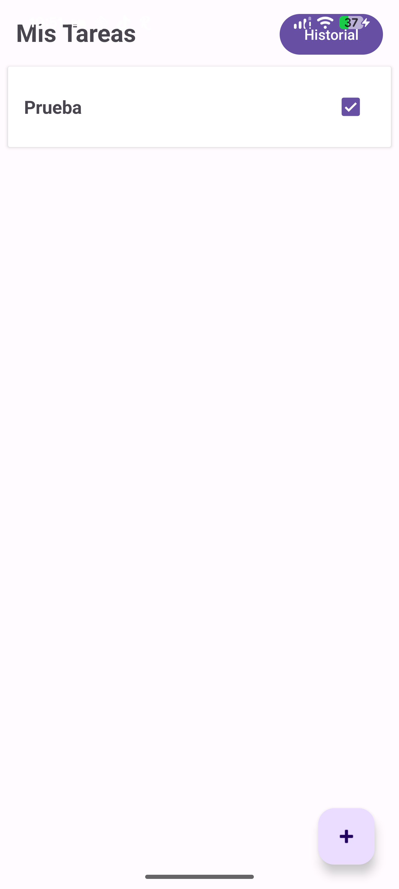
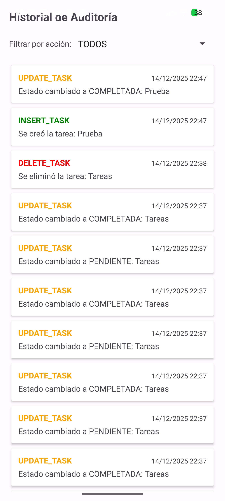
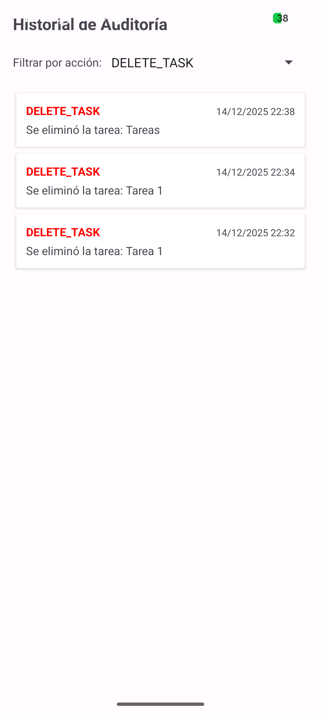

# 🕒 Task Manager & Audit System - Actividad 3

## 📖 Descripción
Aplicación nativa de Android desarrollada en **Java** bajo arquitectura **MVC**.
Este proyecto combina un **Gestor de Tareas** (CRUD completo) con un **Sistema de Auditoría Interna** que registra automáticamente cada acción realizada por el usuario.

### Características Principales
1.  **Gestión de Tareas (Actividad 1):**
    * Crear, Leer, Editar y Eliminar tareas.
    * Marcar tareas como completadas/pendientes.
    * Validaciones de entrada.
2.  **Historial de Auditoría (Actividad 3):**
    * **Registro Automático:** El sistema intercepta las operaciones y guarda un log en la base de datos sin intervención del usuario.
    * **Tipos de Acciones:** `INSERT_TASK`, `UPDATE_TASK`, `DELETE_TASK`.
    * **Consultas:** Pantalla dedicada para visualizar el historial cronológico.
    * **Filtros:** Capacidad de filtrar el historial por tipo de acción.

---

## 🛠️ Instalación y Ejecución

1.  **Clonar el repositorio:**
    ```bash
    git clone [https://github.com/TU_USUARIO/NOMBRE_DEL_REPO.git](https://github.com/TU_USUARIO/NOMBRE_DEL_REPO.git)
    ```
2.  **Base de Datos:**
    * Utiliza **Room Database**.
    * Al actualizar desde la versión anterior, se ejecuta una migración destructiva para incorporar la tabla `history`.

---

## 🗄️ Estructura de la Base de Datos

El sistema utiliza dos tablas relacionadas:

### Tabla: `tasks`
| Columna | Tipo | Descripción |
| :--- | :--- | :--- |
| `id` | INT | Primary Key |
| `task_title` | TEXT | Título de la tarea |
| `is_completed` | BOOL | Estado de la tarea |

### Tabla: `history`
| Columna | Tipo | Descripción |
| :--- | :--- | :--- |
| `history_id` | INT | PK Autogenerada |
| `action` | TEXT | Tipo (INSERT, UPDATE, DELETE) |
| `created_at` | TEXT | Fecha y Hora del evento |
| `details` | TEXT | Descripción del cambio |

---

## 📸 Capturas de Pantalla

### 1. Pantalla Principal
> *Lista de tareas con el botón de acceso al Historial.*



### 2. Historial de Acciones
> *Registro cronológico de operaciones.*



### 3. Filtro de Auditoría
> *Ejemplo filtrando solo las eliminaciones (DELETE).*



---

**Materia:** Cómputo Móvil
**Actividad:** 3 - Historial de Acciones